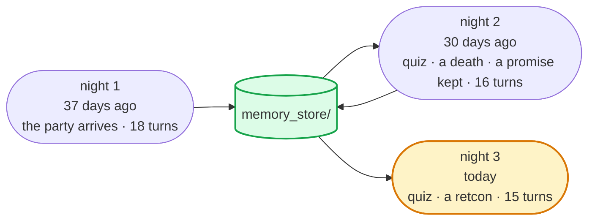
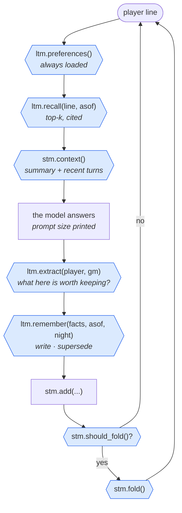

# The Campaign

### Module 6 Bridge Project · due before the Module 7 session · ~5 hours

---

## Why this one is different

In the lab your agent remembered that you prefer metric units, across a
restart, in two runs of one sentence each. Nothing depended on it.

This one is a **game master**. It runs a text adventure for a player across
three game nights. Each night is a new process. Each night is fifteen to
twenty turns of dialogue, which is more than any sane prompt should carry
verbatim. Between nights, a week passes, then a month, and things change: an
NPC dies, a bridge burns, a promise is kept, and the player asks you to
un-happen something.

So it needs **both memories from Module 6, at the same time, and it is graded
on both.** Short-term: a token budget and a fold that keeps the right things.
Long-term: typed facts on disk, superseded when the world changes, forgotten
on request, cited when used. And a number: a **continuity quiz** at the start
of nights 2 and 3, asked as the player, scored against a goldfish game master
that has no memory at all.

---

## The situation



A scripted player (`world/player_night*.md`) plays the same three nights
against your game master. `run_campaign.py` hands your memory the **date of
each night**, so a fact from night 1 is 37 days old on night 3 and nobody
waits 37 days. That is demo 4's backdating trick, used for real.

**The game master itself is given.** `gm_base.py` builds every prompt the
same way and calls into a file that does not exist yet:



**Every blue hexagon is yours.** Plus `forget()` and `cite()`. Eight TODOs,
one file, two classes.

> ### 🔑 Two memories, two questions
>
> **Short-term** answers *"what happened tonight?"* It lives in the prompt and
> dies with the process. Your fold decides what tonight's summary keeps.
>
> **Long-term** answers *"what is true about this campaign?"* It lives on disk.
> Your write policy decides what is a fact, your supersede decides what is
> *still* true, your forget decides what never was.
>
> The quiz at the start of a night is asked in a **new process**. Short-term
> memory is empty. Every right answer came from disk.

---

## Your eight TODOs

All in `campaign_memory_starter.py`. Copy it to `campaign_memory.py` first.

| # | where | function | the policy question | demo |
|:-:|---|---|---|:-:|
| 1 | short-term | `should_fold()` | **the trigger** — a token budget, not a turn count | 2 |
| 2 | short-term | `fold(drop=None)` | **the summarise policy** — what must survive a fold; and how a retcon rewrites the summary | 2 |
| 3 | short-term | `context()` | the bounded context, as messages | 2 |
| 4 | long-term | `extract()` | **the write policy**, by a model — typed facts, `supersedes` when a state changes, `[]` for chatter | 1 |
| 5 | long-term | `remember()` | the write path with **supersede**, not delete; and no duplicates in other words | 1 · 4 |
| 6 | long-term | `decay()` + `recall()` | the read path: filter active *in the query*, floor, per-type decay, **identity check**, diversity | 3 · 4 |
| 7 | long-term | `forget()` | **evict by request** — every row, then count what is left | 4 |
| 8 | — | `cite()` | what the player sees when a remembered fact is used | 1 |

Five numbers sit at the top of the file. `BUDGET_TOKENS`, `KEEP_LAST`,
`MIN_SIM`, `SAME_NAME`, `EVENT_HALF_LIFE_DAYS`. Move any of them if `NOTES.md`
can say what changed on the receipt when you did.

### Before a game night

```bash
../.venv/bin/python verify_memory.py
```

Seventeen checks on a throwaway store. Four make a model call (extraction and
folding *are* model calls) and are marked `[llm]`; the rest are free. About a
minute. **Do not spend a game night on a memory that has not passed.** Each
failure names the TODO and says why.

---

## The three nights

| night | as of | what the script does | what it tests |
|:-:|---|---|---|
| 1 | today − 37 d | Dax and his dog Biscuit arrive. Meet Marra the smith and Mirra the herbalist. Buy feverleaf. Promise Old Tobb his ledger back within a week. Take the ledger — and the Tidewater amulet. Hear a rumour about a Toll-King. Sleep at the Lantern. 18 turns. | write policy quality; **two folds** keep inventory, names, the promise; prompt bounded |
| 2 | today − 30 d | **Quiz on night 1.** Return the ledger (promise fulfilled). The forge burns; **Marra dies**; Dax keeps her hammer. Mirra is fine; buy rope from her. The bridge is gone; meet Sela the ferrywoman. Swear to find who started the fire. 16 turns. | cross-restart recall; **supersede** (alive → dead, promised → kept, standing → burned); **Marra ≠ Mirra** |
| 3 | today | **Quiz on nights 1–2.** Then: *"Retcon — we never took the amulet."* The runner calls your `forget("amulet")`, then your `fold(drop="amulet")`, then asks what Dax is carrying. Visit Mirra, Tobb, Sela, Marra's grave. Recap the campaign. 15 turns. | **forget with proof** in store *and* summary *and* the next answer; decay of a month-old rumour; citations by night |

### What you are aiming at

The reference solution, 20 Sep 2026:

```
MEMORY GAME MASTER
night  as of       turns folds max prompt    area    quiz facts stored model calls
    1  2026-08-14     18     2      2,199  29,371       -           27          38
    2  2026-08-21     16     2      2,367  27,392    9/10           26          44
    3  2026-09-20     15     2      2,385  26,511   10/10           30          42

GOLDFISH GAME MASTER
night  as of       turns folds max prompt    area    quiz facts stored model calls
    2  2026-08-21     16     0      3,285  33,250    2/10            0          26
    3  2026-09-20     15     0      2,727  26,679    4/10            0          25

retcon 'amulet' (night 3): 3 rows deleted, 0 remaining; summary mentions it after re-fold: no; GM's next answer mentions it: no
```

Your digits will differ: the game master is a model at temperature 0.6 and
the extraction is a model too. The **shape** will not. Two folds a night and a
max prompt that stops climbing. A quiz the goldfish cannot pass. A retcon that
is gone in three places.

The goldfish knows the world canon, so it can guess a few answers. It cannot
know your character's name, your dog, what you bought, what you promised, or
that Marra is dead. That gap is what long-term memory *is*.

---

## ⚠ Six traps

Each one is a policy that looks fine and is wrong. Night 2 or night 3 catches
every one of them on the receipt.

**1 · "Fold every six turns."** A turn count gives demo 2's sawtooth — and the
sawtooth still climbs, because the turns get longer. The receipt prints max
prompt per night. Yours should stop going up. That takes a budget.

**2 · "Summarise the conversation."** A summary that reads like a story drops
the inventory by the second fold, and the night-2 quiz asks what you were
carrying. Your fold prompt has to say what *must* survive. The reference names
five things and their order.

**3 · "Store everything, retrieval will sort it out."** A first attempt at the
reference stored thirty-nine facts on night 1, including the smell of the inn
and an NPC smiling. Retrieval did not sort it out: five rows about Mirra filled
every slot and pushed out the one about what you bought from her. Two levers
fix it, one at write time and one at read time. You met both in Part 3.

**4 · "Similar means same."** `Siemens AG` was Module 3's version of this. Here
it is `Marra` and `Mirra`: one letter apart, embedded a whisker apart, and one
of them is dead. The line *"Is Mirra all right?"* must never pull Marra's
death into the prompt. Similarity finds candidates. Something else has to say
who is who. Be honest in your notes about what the model does when you get
this wrong — it copes more often than you would like, and that is not a reason
to skip the check.

**5 · "Delete the old fact when it changes."** Then night 3 cannot answer
*"when did Marra die?"* and the auditor in you cannot show what was believed
before. Supersede: mark the old row, keep it, date it.

**6 · "Forget means delete the rows."** Half the job. Tonight's summary still
says *"carrying the amulet"*, and the game master keeps mentioning it. The
runner checks the store, the summary, and the very next answer. All three.

---

## Setup

```bash
cd Module-06/bridge-project
../.venv/bin/python -m pip install -r requirements.txt      # Module-06\.venv\Scripts\python.exe on Windows
cp campaign_memory_starter.py campaign_memory.py
../.venv/bin/python verify_memory.py                         # fails on TODO 1. That is the correct start.
```

Your `OPENROUTER_API_KEY` is in the repo-root `.env`, same as every module.
No second key: chromadb embeds locally.

```bash
../.venv/bin/python run_campaign.py --night 1               # wipes the store, plays night 1
../.venv/bin/python run_campaign.py --night 2               # NEW PROCESS: quiz, then night 2
../.venv/bin/python run_campaign.py --night 3               # NEW PROCESS: quiz, retcon, night 3
../.venv/bin/python run_campaign.py --night 2 --goldfish    # the control
../.venv/bin/python run_campaign.py --night 3 --goldfish
../.venv/bin/python run_campaign.py --night 3 --quiz-only   # re-ask tonight's quiz after a fix: cheap
../.venv/bin/python run_campaign.py --play                  # free play, your memory, tonight's date
```

A night is about forty model calls and three minutes. Extraction is one call
per turn — that is the price of a model-written write policy, and you should
say so in your notes. Outputs land in `out/`.

---

## Hand in

**1 · `campaign_memory.py`** — the eight functions.

**2 · `out/RECEIPT.txt`** — untouched, with both game masters on it.

**3 · `out/quiz-night3.md` and `out/transcript-night3.md`** — the answers, and
the night, with your citations visible.

**4 · `NOTES.md`** — one page, three questions:

> **a. Your fold.** Paste your fold prompt and your budget. Which quiz question
> did your summary lose the first time, and what did you add? Show max prompt
> per night before and after.
>
> **b. Marra and Mirra.** Paste both night-3 quiz answers. Which line in
> `recall()` keeps them apart, and what happened when you removed it? Be honest
> if the model coped anyway — then say why the check is still there.
>
> **c. The retcon.** Paste the three checks from night 3: rows remaining,
> summary mentions, next answer mentions. Which of the three was hardest to
> get to *no*, and why is that the right order to check them in?

### How to submit

Open an issue on the students repo: **Issues → New issue → "Module 6 Bridge
Project — The Campaign"**. Your name in the title, the four files attached,
the three answers in the boxes.

> ### ⚠ Do not attach `.env` or `memory_store/`.
> One holds your key. The other is your campaign's memory — it stays on your
> machine. That is rather the point.

**Deadline: before the Module 7 session starts.**

---

## Before you submit

- [ ] `verify_memory.py` prints all 17 passed
- [ ] Every night shows at least two folds, and max prompt does not rise across nights
- [ ] Night 2 quiz ≥ 7/10; night 3 quiz ≥ 7/10; the goldfish is well below you on both
- [ ] `Is Marra alive?` → no. `Is Mirra alive?` → yes. Both, on night 3
- [ ] Night 3 receipt line: `0 remaining · summary mentions it: no · GM's next answer mentions it: no`
- [ ] `out/transcript-night3.md` shows citations with a night and a date
- [ ] Superseded rows are still in the store (`status=superseded`), not gone
- [ ] Nothing in the store describes scenery, weather, or what an NPC was doing this turn

---

## Stuck?

**`verify_memory.py` says every similarity is negative** — the store was
created without cosine. The space is fixed at creation: delete
`memory_store/`, fix it, run again.

**Night 2 starts with `0 facts on disk`** — `DB_DIR` is relative, or night 1
ran from a different folder. Look at `open_store()` and `ls memory_store/`.

**Max prompt keeps climbing** — trap 1. Your trigger is a turn count, or your
budget is bigger than the whole night.

**The quiz says "I do not recall" about things that are in the store** — look
at the `[memory] <` lines above the miss. If the fact was recalled and the
model still said no, the fact's wording is too far from the question: tighten
`extract()`'s instructions. If it was not recalled, count how many hits share a
subject. Trap 3.

**`Is Mirra alive?` mentions Marra's death** — trap 4. Look at what `recall()`
does after the query returns.

**Night 3's `Is Marra alive?` says yes** — either the death was stored without
`supersedes` (add a guard: a death is a death whatever the model flagged) or
`recall()` is not filtering `status=active` in the query.

**`summary mentions it after re-fold: YES`** — trap 6. Your fold prompt does
not know about `drop`, or you skipped the fold because the buffer was short.

**`attempt to write a readonly database`** — the store was deleted while a
client held it. Exit and start again. The runner wipes *before* it opens.

**Extraction returns nothing, ever** — `structured()` is returning `None`. Print
the prompt. Usually a field the model cannot fill: make `supersedes` optional.

---

## Optional stretch — only if the above is done

The player writes:

> "Can the NPCs talk in their own voice? And can the rules-keeper stop the
> narrator from resurrecting people?"

Split the game master into three agents — narrator, rules-keeper, NPC-voice —
sharing one store through three different `where` filters. The NPC-voice for
Mirra reads only `npc` facts about Mirra. The rules-keeper reads only
`status=active` state and vetoes contradictions. Print each one's prompt size.

You do not have to build it. Write the paragraph about what each role is
allowed to see and why. **That paragraph is Module 7.**

---

## One last thing

The reference scores 9/10 and 10/10 against a goldfish's 2/10 and 4/10. That is not why
this project exists.

It exists because on night 3 a player says *"we never took the amulet"* and
your game master has to make that true in three places at once — the store,
tonight's summary, and its next sentence — and prove it. Anyone can make an
agent remember. What gets read in `NOTES.md` is whether you made it remember
the right things for the right length of time, at a bounded price, and whether
you can make it *un*-remember on request and show your working.

Memory is what you store. Context is what you show the model. For three
nights, both were your call.

<div align="center"><sub>Agentic AI Bootcamp · Jerusalem High-Tech Foundry × COMCEC</sub></div>
